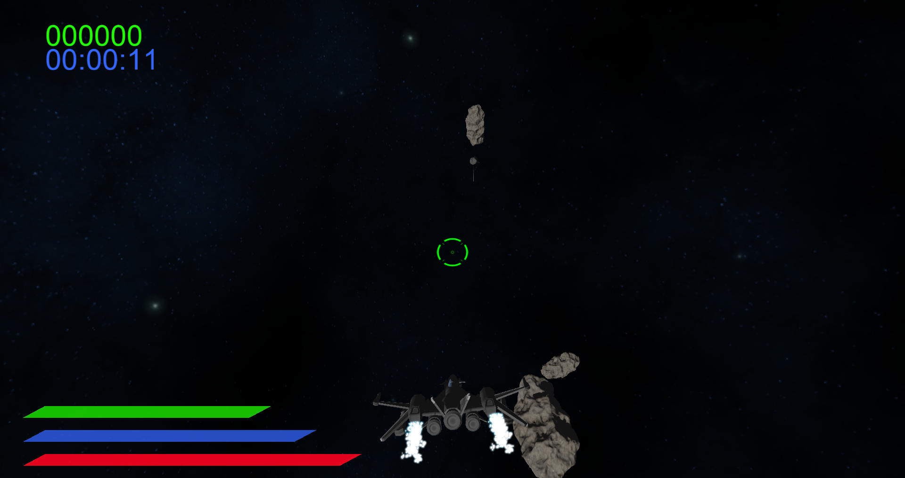

# Projekt GRK: "Asteroids 3D"

Gra 3D polegająca na ochranianiu sondy kosmicznej przed nadlatującymi asteroidami.
Autorzy: Mateusz Szlachetka, Sebastian Jerzykiewicz, Jan Wojciechowski

## Mechaniki gry
Gracz porusza się statkiem kosmicznym w pobliżu sondy i ma za zadanie niszczyć pojawiające się wokół asteroidy w celu obronienia jej.
Zarówno sonda jak i gracz otrzymują obrażenia pod wpływem zderzeń z innymi obiektami.
Aby temu zapobiec gracz może co pewien krótki czas wystrzelić rakietę (która również może zadać obrażenia sondzie).

### Sterowanie
- **W** - ruch do przodu
- **Mysz** - obrót
- **Q/E** - przechylenie w lewo/prawo
- **LMB** - strzał
- **LSHIFT** - boost
- **LAlt** - unik
- **LCtrl** - nawrót o 180&deg;

## Zaimplementowane metody CG:
- Obroty z użyciem kwaternionów
- PBR (z normal mappingiem)
- HDR
- Shadow mapping
- Animacje (krzywe Beziera i slerp)
- Równania ruchu Newtona (obrażenia od kolizji zależne od pędu)
- Geometry shader (eksplozje)
- Particle system (użyty instancing)
- Bloom
- Kolizje z wykorzystaniem sfer otaczających i OBB
- Sprite rendering (HUD)

 

